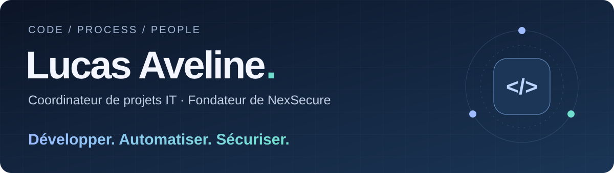

  <a href="https://lucasaveline.fr/"><strong>Portfolio ↗</strong></a> &nbsp; · &nbsp;
  <a href="https://nexsecure.fr/"><strong>NexSecure ↗</strong></a> &nbsp; · &nbsp;
  <a href="https://www.linkedin.com/in/lucas-aveline/"><strong>LinkedIn ↗</strong></a> &nbsp; · &nbsp;
  <a href="https://lucasaveline.fr/pages/contact.html"><strong>Me contacter ↗</strong></a>

 

## La technique au service des usages.

Je suis **Lucas Aveline**, coordinateur de projets informatiques et fondateur de **[NexSecure](https://nexsecure.fr/)**. Je relie les besoins métiers à la technique : applications web, automatisation, cybersécurité et data.

J’aime construire des solutions utiles, comprendre leur fonctionnement de bout en bout et accompagner leur adoption. De l’analyse du besoin au déploiement, je garde le même objectif : **simplifier le quotidien avec des outils fiables et sécurisés.**

<table>
<tr>
<td width="33%" valign="top">
<h3>01 / Développer</h3>
Applications métiers, CRM, interfaces d’administration et intégrations API.
  
<code>Laravel</code> <code>Node.js</code> 
<code>TypeScript</code> <code>JavaScript</code>
</td>
<td width="33%" valign="top">
<h3>02 / Automatiser</h3>
Workflows, scripts et données pour réduire les tâches répétitives.
  
<code>Python</code> <code>PowerShell</code> 
<code>Power Automate</code> <code>Power Apps</code>
</td>
<td width="33%" valign="top">
<h3>03 / Sécuriser</h3>
Identités, accès, infrastructures et sensibilisation des utilisateurs.
  
<code>Entra ID</code> <code>MFA / SSO</code> 
<code>Microsoft 365</code> <code>Cloudflare</code>
</td>
</tr>
</table>

## En ce moment

- **Projets IT transverses** : cybersécurité, automatisation, développement et data, en lien avec les équipes métiers.
- **NexSecure** : conception d’applications et d’outils sur mesure, de l’architecture à la mise en production.
- **Sup de Vinci** : parcours en direction de projets informatiques, après une spécialisation en développement.
- **Data & BI** : SQL, Snowflake et Power BI pour transformer les données en informations utiles.

## Quelques points d’entrée

| Projet | Ce que tu peux y découvrir |
| :--- | :--- |
| **[Portfolio 2026 ↗](https://lucasaveline.fr/)** | Mon parcours, mes réalisations, ma veille et des expériences interactives. **[Le code](https://github.com/Sunlama0/Portfolio-LA)** |
| **[CarbonTrack ↗](https://github.com/Sunlama0/carbontrack-hackaton)** | Projet collectif de hackathon : empreinte carbone de sites physiques, avec une application web et mobile. `React` `Spring Boot` `PostgreSQL` |
| **[Jeux & autres ↗](https://lucasaveline.fr/pages/jeux.html)** | Dix expériences à essayer : morpion, quiz, générateur de mots de passe et petites interfaces web. |

<strong>Mon environnement technique</strong>

 

| Domaine | Outils & technologies |
| :--- | :--- |
| Développement | Laravel · Node.js · JavaScript / TypeScript · Tailwind CSS · API REST |
| Automatisation | Python · PowerShell · Power Apps · Power Automate |
| Données | SQL · MongoDB · Snowflake · Power BI |
| Identités & cloud | Microsoft 365 · Entra ID · MFA / SSO · Cloudflare |
| Outils | Git · GitHub · Datadog |

 

---

### Une idée, un projet, un besoin métier ?

Avec **[NexSecure](https://nexsecure.fr/)**, je conçois des solutions digitales pour sécuriser, automatiser et faire évoluer les opérations des entreprises.

**[Parlons de ton projet ↗](https://lucasaveline.fr/pages/contact.html)** &nbsp; · &nbsp; [Découvrir mon parcours](https://lucasaveline.fr/pages/experiences.html)
